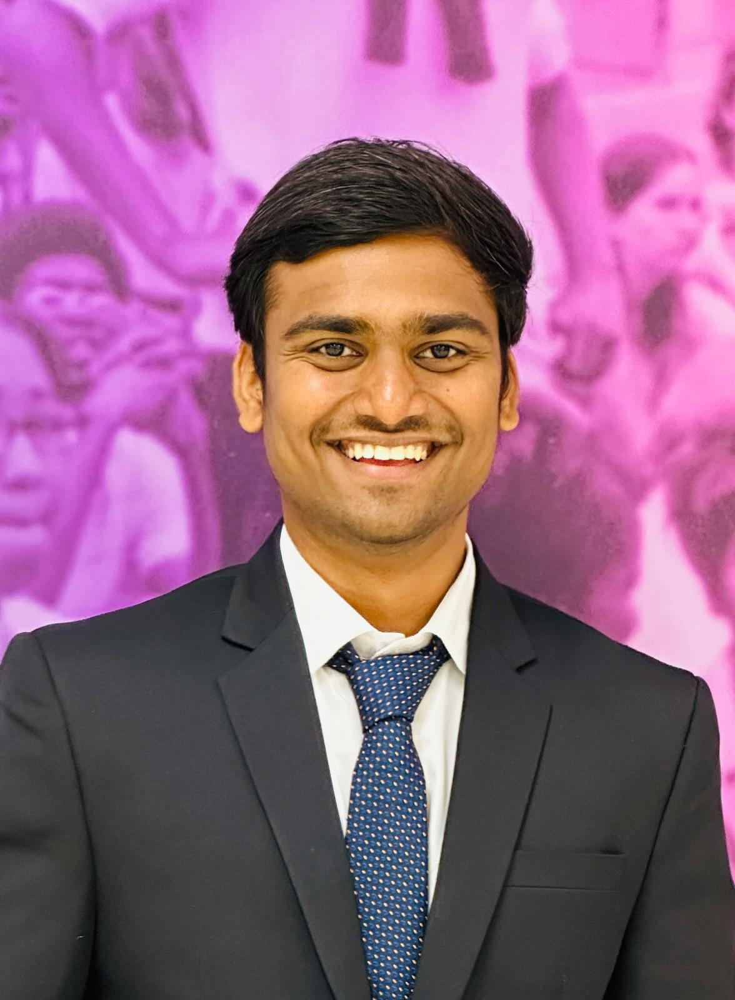

# website
Personal Website
<!DOCTYPE html>
<html lang="en">
<head>
    <meta charset="UTF-8">
    <meta name="viewport" content="width=device-width, initial-scale=1.0">
    <link rel="stylesheet" href="https://cdnjs.cloudflare.com/ajax/libs/font-awesome/6.1.1/css/all.min.css">
    <title>Rohit Reddy Amidi - Portfolio</title>
    <link rel="stylesheet" href="styles.css">
    <meta name="viewport" content="width=device-width, initial-scale=1.0">
</head>
<body>
    <aside class="sidebar">
        

            
            <h1>Rohit Reddy Amidi</h1>
            
Mechanical Engineer | Graduate Student

            <a href="https://drive.google.com/file/d/1a4CS9zOeu6CUI-BKCSa76g2vS3G70fDX/view?usp=drive_link" title="" target="_blank" style="color: #fff;">Download CV</a>
        

        <nav>
            <ul>
                <li><a href="#about"><i class="fas fa-user"></i> About</a></li>
                <li><a href="#education"><i class="fas fa-graduation-cap"></i> Education</a></li>
                <li><a href="#experience"><i class="fas fa-briefcase"></i> Experience</a></li>
                <li><a href="#skills"><i class="fas fa-cogs"></i> Skills</a></li>
                <li><a href="#projects"><i class="fas fa-code"></i> Projects</a></li>
                <li><a href="#contact"><i class="fas fa-envelope"></i> Contact</a></li>
            </ul>
        </nav>
    </aside>
    <main>
    <!-- <header>
        <h1>Rohit Reddy Amidi</h1>
        
Mechanical Engineer | Graduate Student

    </header>

    <nav>
        <ul>
            <li><a href="#about">About</a></li>
            <li><a href="#education">Education</a></li>
            <li><a href="#experience">Experience</a></li>
            <li><a href="#skills">Skills</a></li>
            <li><a href="#projects">Projects</a></li>
            <li><a href="#contact">Contact</a></li>
        </ul>
    </nav> -->

    <section id="about">
        <h2>About Me</h2>
        
I am a passionate Mechanical Engineer pursuing a Master's degree in Mechanical Engineering at the University of Florida. With a strong background in Product design and manufacturing, I have 2+ year's experience in developing Mechanical components and Electromechanical systems for flight vehicles. My expertise spans across Product deisgn, Manufacturing and Project management.

    </section>

    <section id="education">
        <h2>Education</h2>
        

            <h3>Master of Science, Mechanical Engineering</h3>
            
University of Florida

            
August 2023 – May 2025

        

        

            <h3>Bachelor of Technology, Mechanical Engineering</h3>
            
Vidya Jyothi Institute of Technology | CGPA: 9.02/10

            
July 2017 – May 2021

        

    </section>

    <section id="experience">
        <h2>Experience</h2>
        

            

                

                    <h3>Graduate Student Researcher - <i class="company-name">University of Florida (UFIFAS)</i></h3>
                    
Gainesville, Florida | May 2024 – present

                    <ul>
                        <li>Designed a system for fruit analysis utilizing SolidWorks and rapid-prototyped parts using 3D printing in-house, saving over $12,000 in product costs. Reduced area by 10% than already existing systems.</li>
                        <li>Integrated different sensors controlled by raspberry pi to detect fruit quality and analyze the fruit. 4 different sensors integrated with space for more.</li>
                        <li>Designing and fabricating a refrigerator enclosure for fast breeding of blueberry’s in a controlled temperature, humidity and UV lighting conditions.</li>
                        <li>Automating the temperature control system, sprinkler system and UV Light radiation system so that the systems can be controlled remotely.</li>

                    </ul>
                

            

            

                

                    <h3>Graduate Teaching Assistant - <i class="company-name">University of Florida</i></h3>
                    
Gainesville, Florida | January 2024 – May 2024

                    <ul>

                        <li>Course : Engineering Mechanics (Statics).</li>
                        <li>Provided academic support to students through office hours and individual consultations.</li>
                        <li>Conducted review sessions for exams and reinforced key course concepts.</li>
                        <li>Graded assignments and exams for various engineering courses, providing constructive feedback to students.</li>
                        <li>Collaborated with teaching staff to develop and implement effective teaching strategies, activities, and assessments.</li>

                    </ul>
                

            

            

                

                    <h3>Mechanical Design Engineer - <i class="company-name">Research Centre Imarat(RCI)</i></h3>
                    
Hyderabad, India | August 2021 – July 2023

                    <ul>
                        <li>Developed conceptual, preliminary, and detailed design for avionic structures, as well as associated electromechanical systems, including battery systems and telecommunication systems such as antennas based on DFM/DFA principles.</li>
                        <li>Designed Mechanical testing systems, including Integration Jigs, Fixtures, and interface rings, for structural, thermal, and vibrational testing of avionic structures and component, as well as specialized handling beams like J-beam and lifting beams.</li>
                        <li>Designed airframes for aerospace structures to achieve a robust, resilient, and lightweight construction so that it withstands the high inertial and thermal loads while also minimizing overall weight by 30% and enhance the efficiency and range by 18%.</li>
                        <li>Performed structural analysis such as linear static and dynamic analyses for flight vehicles and interface structures exposed to substantial inertial loads. Additionally, conducted thermal design and analysis for thermal battery packages and battery mounting components with the objective of minimizing heat flow from the batteries using FEA tools such as ANSYS, ABAQUS.</li>
                        <li>Developed analytical and numerical design calculations pertaining to mechanical components, including springs, bearings, and gears. Furthermore, I conducted fastener analysis specifically focused on sectional intersection joints within a flight vehicle.</li>
                        <li>Involved and worked in all phases of product development of aero-mechanical systems including 3D and 2D drafting, prototyping, testing, qualification and manufacturing. Applied GD&T principles for drafting part and assembly drawings.</li>
                        <li>Compiled product data, design layouts and simulation data and filed reports in conformity with engineering principles and quantification. Additionally performed the Root Cause Analysis for the structures that failed in the structural tests.</li>

                    </ul>
                

            

        

    </section>

    <section id="skills">
        <h2>Technical Skills</h2>
        

            <h3>Languages:</h3>
            <ul>
                <li>Java</li>
                <li>Python</li>
                <li>C</li>
                <li>C++</li>
                <li>SQL</li>
                <li>JavaScript</li>
                <li>HTML</li>
                <li>CSS</li>
            </ul>
            <h3>Databases:</h3>
            <ul>
                <li>MySQL</li>
                <li>MongoDB</li>
            </ul>
            <h3>Frameworks & Developer Tools:</h3>
            <ul>
                <li>Spring Boot</li>
                <li>Apache Thrift</li>
                <li>React.js</li>
                <li>Django</li>
                <li>Node.js</li>
                <li>Flask</li>
                <li>RabbitMQ</li>
                <li>Redis</li>
                <li>JUnit</li>
                <li>Splunk</li>
                <li>Git</li>
                <li>GitHub</li>
                <li>JIRA</li>
                <li>Jenkins</li>
                <li>Postman</li>
                <li>Kubernetes</li>
                <li>REST APIs</li>
            </ul>
        

    </section>

    <section id="projects">
        <h2>Projects</h2>
        

            

                
                

                    <h3>Library Management System</h3>
                    
A Library Management System using Java, Red-Black trees, Heaps.

                

                

                    <button>View Demo</button>
                    <button onclick=" window.open('https://github.com/charithesh16/Gator-Library-Management-System','_blank')"">GitHub</button>
                

            

            

                
                

                    <h3>Human Emotion Detection</h3>
                    
A Django application integrated with deep learning model to human emotions using realtime video streaming, text and image.

                

                

                    <button>View Demo</button>
                    <button onclick=" window.open('https://github.com/charithesh16/Emotion-Recognition','_blank')">GitHub</button>
                

            

            

                
                

                    <h3>Dream 11</h3>
                    
A Django based fantasy cricket game application. User can create a team, join contests. User can see the points and leaderboard.

                

                

                    <button>View Demo</button>
                    <button onclick=" window.open('https://github.com/charithesh16/Fantasy-Cricket-Game','_blank')"">GitHub</button>
                

            

            

                
                

                    <h3>COVID-19 Live Information</h3>
                    
A React application to monitor worldwide COVID-19 status, presenting country-specific data. 

                

                

                    <button>View Demo</button>
                    <button>GitHub</button>
                

            

            

                
                

                    <h3>Plant Seedlings Classification</h3>
                    
A web based Flask application that classifies the uploaded plant seedling image to one of the 12 different species using Convolutional Neural Networks.

                

                

                    <button>View Demo</button>
                    <button onclick=" window.open('https://github.com/charithesh16/Plant-Seedlings-Classification','_blank')"">GitHub</button>
                

            

            

                
                

                    <h3>E-commerce application</h3>
                    
A demo E-commerce application with cart,orders and invoice capabilities developed using Node.js and React.js

                

                

                    <button>View Demo</button>
                    <button onclick=" window.open('https://github.com/charithesh16/ecommerce','_blank')"">GitHub</button>
                

            

            

                
                

                    <h3>Restaurant Website</h3>
                    
A static react web app.

                

                

                    
                    <button onclick=" window.open('https://charithesh16.github.io/confusion/','_blank')"">View Demo</button>
                    <button onclick=" window.open('https://github.com/charithesh16/confusion','_blank')"">GitHub</button>
                

            

        

    

    </section>

   <section id="contact">
        

            <h2>Contact Information</h2>
            <ul>
                <li><i class="fas fa-envelope"></i><a  style="color: white;" href="mailto:charithesh1632@gmail.com">charithesh1632@gmail.com</a></li>
                <li><i class="fas fa-phone"></i> +1 (352)-709-9293</li>
                <li><i class="fas fa-map-marker-alt"></i> Gainesville, Florida</li>
            </ul>
            

                <a href="https://linkedin.com/in/charithesh" target="_blank"><i class="fab fa-linkedin"></i></a>
                <a href="https://github.com/charithesh16" target="_blank"><i class="fab fa-github"></i></a>
                <!-- Add more social media icons as needed -->
            

        

        <!-- 

            <h2>Get In Touch</h2>
            <form action="mailto:charithesh1632@gmail.com" method="post" enctype="text/plain">
                <input type="text" placeholder="Name" required>
                <input type="email" placeholder="Email" required>
                <textarea placeholder="Message" required rows="5"></textarea>
                <button type="submit">Send Message</button>
            </form>
        
 -->
    </section>
    
Copyright © 2024 Charithesh Puppireddy. All Rights Reserved.

</main>

</body>
</html>
